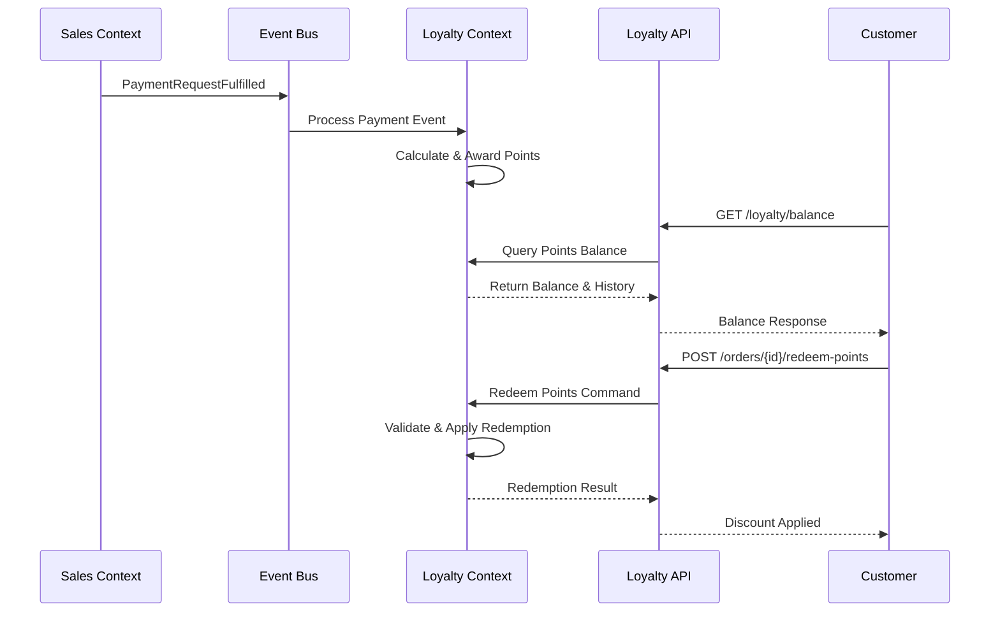

# Design Document

## Overview

The loyalty points feature will be implemented as a new bounded context within the existing DDD Starter for .NET architecture. It will integrate with the Sales bounded context through domain events, following the established patterns of the system. The design leverages the existing technical infrastructure (TechnicalStuff) and follows the same layered architecture approach used by other bounded contexts.

The loyalty system will be event-driven, responding to order completion events from the Sales context and providing APIs for point balance queries and redemption operations. This approach ensures loose coupling between bounded contexts while maintaining data consistency.

## Architecture

### Bounded Context Structure

Following the established pattern, the Loyalty bounded context will consist of:

```
Sources/Loyalty/
├── Loyalty.DeepModel/           # Domain layer with rich business logic
├── Loyalty.ProcessModel/        # Application services and use case handlers  
├── Loyalty.Adapters/           # Infrastructure implementations
├── Loyalty.RestApi/            # HTTP API controllers
└── Loyalty.IntegrationTests/   # End-to-end tests
```

### Integration Points

1. **Event Subscription**: Listen to `PaymentRequestFulfilled` events from Sales context
2. **Client Integration**: Use existing `ClientId` from Sales.DeepModel for customer identification
3. **Order Integration**: Reference order information for point calculation and audit trails
4. **Configuration**: Leverage existing configuration patterns for point rules

### Event Flow



## Components and Interfaces

### DeepModel Layer

#### Core Aggregates

**LoyaltyAccount Aggregate**
- Manages point balance and transaction history for a client
- Enforces business rules for point earning, redemption, and expiration
- Maintains audit trail of all point transactions

**PointTransaction Value Object**
- Immutable record of point earning or redemption
- Contains transaction type, amount, reference data, and timestamps

**LoyaltyConfiguration Value Object**
- Encapsulates configurable business rules
- Point earning ratios, redemption ratios, expiration policies

#### Domain Services

**PointCalculationService**
- Calculates points earned based on order amount and current rules
- Handles different calculation strategies for different customer tiers

**ExpirationPolicyService**
- Manages point expiration logic
- Implements FIFO redemption strategy

#### Repository Interfaces

```csharp
public interface LoyaltyAccountRepository
{
    Task<LoyaltyAccount> GetByClientId(ClientId clientId);
    Task Save(LoyaltyAccount account);
}

public interface LoyaltyConfigurationRepository  
{
    Task<LoyaltyConfiguration> GetCurrent();
    Task Save(LoyaltyConfiguration configuration);
}
```

### ProcessModel Layer

#### Command Handlers

**AwardPointsHandler**
- Processes payment completion events
- Calculates and awards points to customer accounts
- Publishes `PointsAwarded` events

**RedeemPointsHandler**
- Handles point redemption requests during checkout
- Validates available balance and applies redemption
- Publishes `PointsRedeemed` events

**UpdateLoyaltyConfigurationHandler**
- Manages administrative configuration changes
- Validates configuration rules and applies updates

#### Query Handlers

**GetLoyaltyBalanceHandler**
- Returns current point balance and recent transaction history
- Handles pagination for transaction history

**GetLoyaltyReportsHandler**
- Generates administrative reports on program performance
- Aggregates metrics for business analysis

#### Events

```csharp
public class PointsAwarded : DomainEvent
{
    public ClientId ClientId { get; }
    public int PointsEarned { get; }
    public Guid OrderId { get; }
    public DateTime AwardedAt { get; }
}

public class PointsRedeemed : DomainEvent  
{
    public ClientId ClientId { get; }
    public int PointsRedeemed { get; }
    public decimal DiscountAmount { get; }
    public Guid OrderId { get; }
}
```

### Adapters Layer

#### Database Integration

**LoyaltyDbContext**
- Entity Framework context for loyalty data persistence
- Includes tables for accounts, transactions, and configuration

**LoyaltyAccountSqlRepository**
- SQL implementation of loyalty account repository
- Optimized queries for balance and transaction retrieval

#### Event Integration

**PaymentEventHandler**
- Subscribes to `PaymentRequestFulfilled` events from Sales context
- Triggers point awarding process through command dispatch

**LoyaltyEventOutbox**
- Publishes loyalty domain events to message bus
- Ensures reliable event delivery using outbox pattern

### RestApi Layer

#### Controllers

**LoyaltyController**
- GET `/api/loyalty/clients/{clientId}/balance` - Get point balance and history
- POST `/api/loyalty/clients/{clientId}/redeem` - Redeem points for discount
- GET `/api/loyalty/reports` - Administrative reporting (admin only)

**LoyaltyConfigurationController**
- GET `/api/loyalty/configuration` - Get current loyalty rules
- PUT `/api/loyalty/configuration` - Update loyalty rules (admin only)

## Data Models

### Database Schema

**LoyaltyAccounts Table**
```sql
CREATE TABLE LoyaltyAccounts (
    ClientId UUID PRIMARY KEY,
    CurrentBalance INTEGER NOT NULL DEFAULT 0,
    TotalEarned INTEGER NOT NULL DEFAULT 0,
    TotalRedeemed INTEGER NOT NULL DEFAULT 0,
    CreatedAt TIMESTAMP NOT NULL,
    UpdatedAt TIMESTAMP NOT NULL
);
```

**PointTransactions Table**
```sql
CREATE TABLE PointTransactions (
    Id UUID PRIMARY KEY,
    ClientId UUID NOT NULL REFERENCES LoyaltyAccounts(ClientId),
    TransactionType VARCHAR(20) NOT NULL, -- 'EARNED', 'REDEEMED', 'EXPIRED'
    PointAmount INTEGER NOT NULL,
    OrderId UUID NULL,
    Description VARCHAR(500),
    ExpiresAt TIMESTAMP NULL,
    CreatedAt TIMESTAMP NOT NULL
);
```

**LoyaltyConfiguration Table**
```sql
CREATE TABLE LoyaltyConfiguration (
    Id UUID PRIMARY KEY,
    EarningRatio DECIMAL(10,4) NOT NULL, -- Points per currency unit
    RedemptionRatio DECIMAL(10,4) NOT NULL, -- Points per discount unit  
    ExpirationMonths INTEGER NOT NULL,
    MinimumOrderAmount DECIMAL(10,2),
    IsActive BOOLEAN NOT NULL DEFAULT true,
    CreatedAt TIMESTAMP NOT NULL
);
```

### Domain Model Classes

```csharp
public class LoyaltyAccount : AggregateRoot
{
    public ClientId ClientId { get; private set; }
    public int CurrentBalance { get; private set; }
    public IReadOnlyList<PointTransaction> Transactions { get; private set; }
    
    public void AwardPoints(int points, Guid orderId, LoyaltyConfiguration config);
    public RedemptionResult RedeemPoints(int points, Guid orderId, LoyaltyConfiguration config);
    public void ExpirePoints(DateTime cutoffDate);
}

public class PointTransaction : ValueObject
{
    public TransactionType Type { get; }
    public int Amount { get; }
    public Guid? OrderId { get; }
    public DateTime CreatedAt { get; }
    public DateTime? ExpiresAt { get; }
    public string Description { get; }
}
```

## Error Handling

### Domain Errors

**InsufficientPointsError**
- Thrown when attempting to redeem more points than available
- Includes current balance and requested amount for client feedback

**InvalidConfigurationError**
- Thrown when loyalty configuration violates business rules
- Provides specific validation failure details

**ExpiredPointsError**
- Thrown when attempting to use expired points
- Includes expiration date and available alternatives

### Infrastructure Errors

**LoyaltyAccountNotFoundError**
- Thrown when loyalty account doesn't exist for client
- Triggers automatic account creation in some scenarios

**ConfigurationNotFoundError**
- Thrown when no active loyalty configuration exists
- Falls back to default configuration values

### Error Response Format

```json
{
  "error": {
    "code": "INSUFFICIENT_POINTS",
    "message": "Not enough points available for redemption",
    "details": {
      "availablePoints": 150,
      "requestedPoints": 200,
      "clientId": "123e4567-e89b-12d3-a456-426614174000"
    }
  }
}
```

## Testing Strategy

### Unit Testing

**Domain Model Tests**
- Test point calculation logic with various scenarios
- Validate business rule enforcement (expiration, redemption limits)
- Test aggregate invariants and state transitions

**Command Handler Tests**
- Mock repository dependencies and test business logic
- Verify event publishing for successful operations
- Test error handling and validation scenarios

### Integration Testing

**Database Integration**
- Test repository implementations against real database
- Verify transaction handling and data consistency
- Test concurrent access scenarios

**Event Integration**
- Test event subscription and processing end-to-end
- Verify message ordering and duplicate handling
- Test failure scenarios and retry mechanisms

### API Testing

**Controller Tests**
- Test HTTP endpoints with various input scenarios
- Verify authentication and authorization
- Test error response formats and status codes

**End-to-End Tests**
- Complete user journeys from order completion to point redemption
- Cross-bounded-context integration scenarios
- Performance testing under load

### Test Data Management

**Test Fixtures**
- Predefined loyalty accounts with known balances
- Sample transactions for history testing
- Various configuration scenarios

**Database Seeding**
- Automated test data setup for integration tests
- Cleanup procedures for test isolation
- Performance test data generation