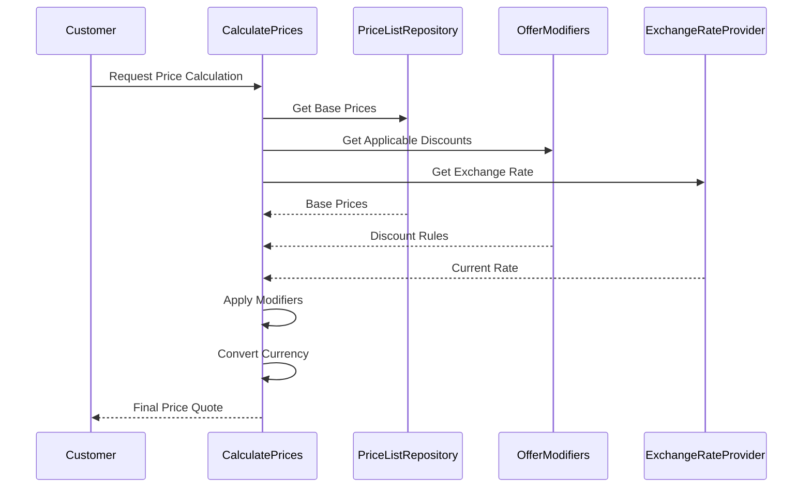

# Price Calculation Process

## Business Overview
This document describes how our system calculates prices for customer orders. The process ensures that all customers receive accurate, fair, and consistent pricing based on their specific circumstances, sales channel, and current market conditions.

## Process Flow

## Process flow Description

### 1. Price Request Processing
- System receives price calculation request
- Identifies customer and sales channel
- Determines products and quantities
- *Note: `CalculatePrices` service orchestrates the entire price calculation process*

### 2. Base Price Determination
- Retrieves customer's specific price list
- Applies base prices for each product
- Considers customer's pricing tier
- *Note: `PriceListRepository` maintains all customer-specific pricing rules*

### 3. Discount Application
- Identifies applicable discounts
- Applies special offers
- Considers sales channel specific pricing
- *Note: `OfferModifiers` service determines and applies appropriate discounts*

### 4. Currency Conversion
- Applies current exchange rates
- Ensures accurate currency conversion
- Maintains price consistency
- *Note: `ExchangeRateProvider` ensures accurate currency conversion*

## Key Business Rules

### Price Calculation Components
- Base prices are determined by the customer's price list
- Special offers and discounts are applied based on customer type and order context
- Currency conversion is applied when needed
- All price calculations are performed in real-time
- *Note: `PriceListRepository` maintains customer-specific pricing rules and base prices*

### Price Modification Rules
- Different customers may receive different discounts
- Discounts can vary based on the sales channel used
- Special offers are applied based on customer history and current promotions
- *Note: `OfferModifiers` service determines appropriate discounts and special offers for each customer*

### Currency Handling
- Prices can be calculated in different currencies
- Exchange rates are always current
- Currency conversion is transparent to the customer
- *Note: `ExchangeRateProvider` ensures accurate and up-to-date currency conversion rates*

## Business Outcomes

### Successful Price Calculation
- Customer receives accurate price quote
- All applicable discounts are applied
- Currency conversion is correct
- *Note: `CalculatePrices` service ensures all calculations are performed accurately*

### Price Calculation Rules
- Prices are always calculated in real-time
- No cached or outdated prices are used
- All calculations are transparent and auditable
- *Note: The system maintains a complete audit trail of all price calculations*

## Compliance and Validation
- All price calculations follow business rules
- Discounts are applied according to customer agreements
- Currency conversions use official exchange rates
- *Note: The system ensures compliance with all pricing policies and regulations*

## Customer Experience
- Immediate price quotes
- Transparent pricing structure
- Consistent pricing across channels
- *Note: The pricing system provides a seamless experience for both customers and sales staff*

## System Components Overview
*For technical reference:*
- **CalculatePrices**: Main service orchestrating the price calculation process
- **PriceListRepository**: Manages customer-specific pricing rules and base prices
- **OfferModifiers**: Determines and applies appropriate discounts and special offers
- **ExchangeRateProvider**: Provides current exchange rates for currency conversion

## Related Business Processes
- Order Placement (uses calculated prices for order validation)
- Price Cart (uses calculated prices to return them to the user for preview) 