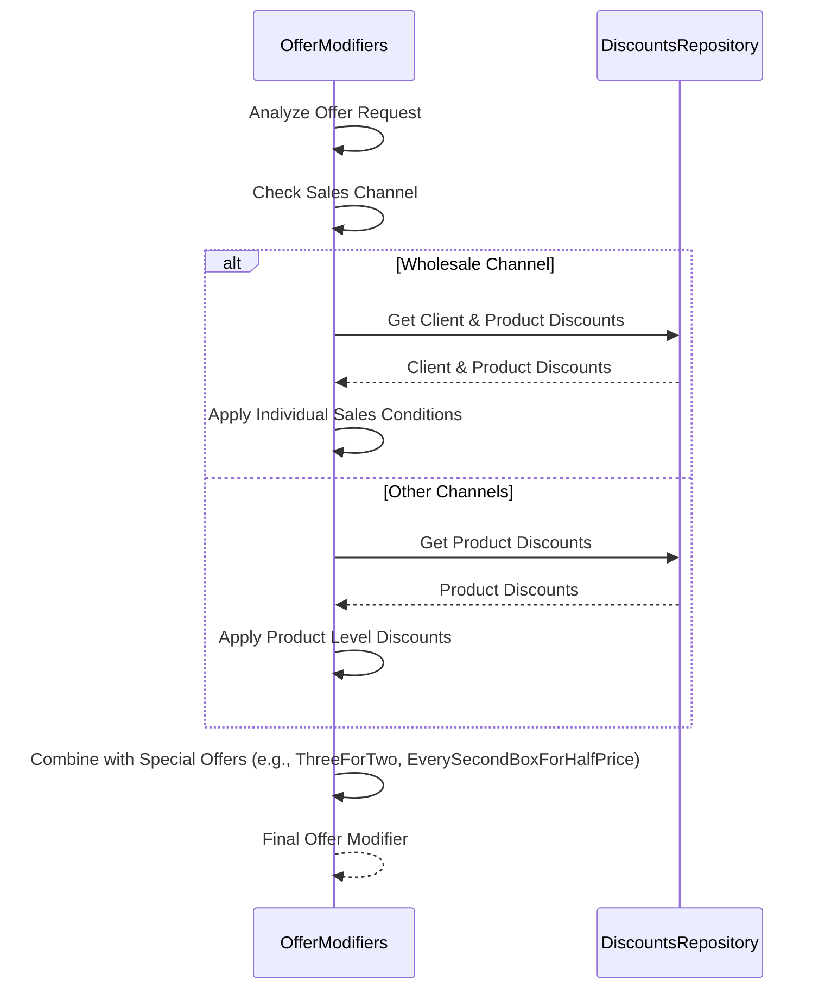

# Offer Modifiers Selection Process

## Business Overview
This document explains how our system determines and applies special offers and discounts to customer orders. The process ensures that every customer receives the best possible deal according to their profile, the products in their order, and the current sales channel.

## Process Flow

## Process Flow Description

### 1. Offer Request Analysis
- The system receives a request to determine which discounts and special offers can be applied to a specific order
- The request includes customer information, products, and sales channel
- *Note: `OfferModifiers` is the main component responsible for orchestrating this process*

### 2. Sales Channel Evaluation
- The system checks if the order is placed through the wholesale channel or another channel (e.g., online sales)
- *Note: Different rules may apply depending on the sales channel*

### 3. Discount Retrieval
- For wholesale channel orders, both client-level and product-level discounts are considered
- For other channels, only product-level discounts are applied
- *Note: `DiscountsRepository` provides all relevant discount information*

### 4. Special Offers Application
- The system checks if special offers like "Three for Two" or "Every Second Box for Half Price" can be applied
- These offers are combined with standard discounts to maximize customer benefit
- *Note: Special offer logic is built into the `OfferModifiers` component*

### 5. Final Offer Modifier Creation
- All applicable discounts and special offers are combined into a single modifier
- This modifier is used in the price calculation process to ensure the customer receives the best possible price
- *Note: The result is an `OfferModifier` object, which is used by the pricing system*

## Key Business Rules
- Customers in the wholesale channel may receive both client-level and product-level discounts
- Other customers receive only product-level discounts
- Special offers are always checked and applied if eligible
- All rules are applied automatically and transparently
- *Note: The system ensures fairness and consistency in applying discounts and offers*

## Business Outcomes
- Customers receive all discounts and special offers they are eligible for
- The process is transparent and consistent
- The best possible price is always calculated for each order
- *Note: The system maintains a complete audit trail of all applied discounts and offers*

## System Components Overview
*For technical reference:*
- **OfferModifiers**: Main factory responsible for selecting and combining discounts and special offers
- **DiscountsRepository**: Provides client-level and product-level discount data
- **OfferModifier**: Represents the combined set of discounts and special offers to be applied
- **SalesChannel**: Determines which discount rules are relevant
- **Special Offer Logic**: Includes rules for offers like "Three for Two" and "Every Second Box for Half Price"

## Related Processes
- Calculate Prices (uses the selected offer modifiers during price calculation) 