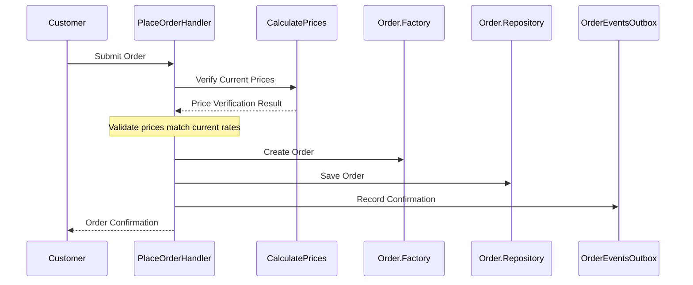

# Online Order Placement Process

## Business Overview
This document describes the process of placing an order through our online sales channel. The process ensures that orders are placed correctly, prices are validated, and all necessary information is recorded for further processing.

## Process Flow

## Process flow description

### 1. Order Submission
- Customer submits their order with selected products and prices
- System captures customer identification and invoicing details
- *Note: `Order.Factory` validates and structures this information according to our business rules*

### 2. Price Verification
- System automatically checks if the prices used in the order are current
- If prices have changed, the order is rejected
- This ensures customers cannot place orders with outdated prices
- *Note: `CalculatePrices` service maintains real-time price information and handles all price validations*

### 3. Order Processing
- System creates a permanent record of the order
- Order is marked as confirmed
- System generates a unique order reference number
- *Note: `Order.Repository` ensures data consistency and maintains the order's state throughout its lifecycle*

### 4. Confirmation
- Customer receives immediate confirmation of their order
- Order details are recorded for future reference
- System is ready to process the next steps in order fulfillment
- *Note: `OrderEventsOutbox` ensures reliable delivery of order confirmations*

## Key Business Rules

### Price Validation
- All orders must be placed with current, valid prices
- The system automatically verifies that the prices used in the order match the current pricing
- If prices have changed since the order was initiated, the order cannot be completed
- This rule prevents orders from being placed with outdated or incorrect prices
- *Note: Price verification is handled by `CalculatePrices` service, which maintains a single source of truth for all product prices*

### Order Creation Rules
- Each order must be associated with a valid customer account
- Orders must include complete invoicing details
- The system automatically records the exact time when the order is placed
- All orders are immediately confirmed upon successful placement
- *Note: `Order.Factory` ensures that all orders are created with consistent structure and required information*

### Security and Access
- Only registered retail customers can place orders
- Each order is linked to a specific customer account
- The system maintains a complete audit trail of all orders
- *Note: `Order.Repository` securely stores all order information and maintains the history of changes*

## Business Outcomes

### Successful Order Placement
- Customer receives immediate confirmation
- Order is recorded in the system
- Order is ready for processing by the fulfillment team
- *Note: `Order.Repository` maintains a complete audit trail of all successful orders*

### Failed Order Placement
- Customer is notified if prices have changed
- Customer can review current prices and resubmit the order
- No partial or invalid orders are created in the system
- *Note: `PlaceOrderHandler` ensures that only complete and valid orders are processed*

## Compliance and Validation
- All orders are validated against current pricing
- Customer information is verified
- Invoicing details are required and validated
- System maintains complete records for auditing purposes
- *Note: Our technical infrastructure ensures that all validations are performed consistently and reliably*

## Customer Experience
- Immediate feedback on order status
- Clear communication if price changes affect the order
- Guaranteed price accuracy at the time of order placement
- Seamless transition to order confirmation
- *Note: Our system components work together to provide a smooth and reliable ordering experience*

## System Components Overview
*For technical reference:*
- **CalculatePrices**: Service that manages and validates all product prices
- **Order.Factory**: Creates and validates new orders with proper structure
- **Order.Repository**: Stores and manages order data with complete history
- **OrderEventsOutbox**: Handles reliable delivery of order confirmations
- **PlaceOrderHandler**: Main process orchestrator that ensures all business rules are followed
- **SalesCrudOperations**: Manages the creation of order headers in the system
- **Clock**: Provides accurate timestamps for order placement

## Related Business Processes
- Order Fulfillment (triggered by `OrderPlaced` event)
- Invoice Generation (uses order details from `OrderHeader`)
- Customer Notification (handled by `OrderEventsOutbox`) 