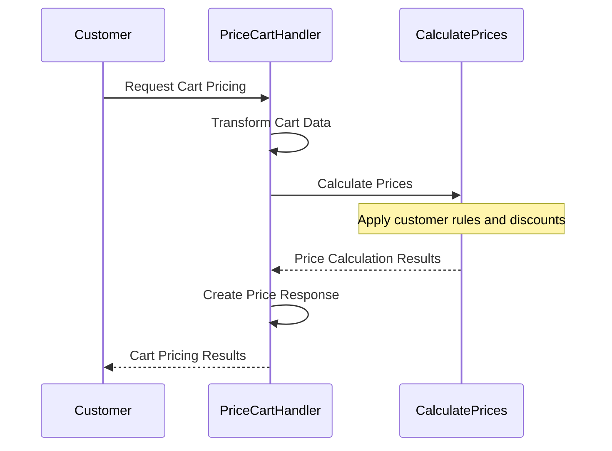

# Cart Pricing Process

## Business Overview
This document describes how our system calculates prices for items in a customer's shopping cart. The process provides customers with accurate, real-time pricing information before they proceed to place their order, ensuring transparency and confidence in the purchase decision.

## Process Flow

## Process Flow Description

### 1. Cart Data Processing
- System receives cart pricing request
- Identifies customer and their preferred currency
- Processes cart items and quantities
- *Note: `PriceCartHandler` transforms the request into domain model format*

### 2. Price Calculation
- Sends cart data to pricing service
- Applies customer-specific pricing rules
- Calculates prices for all items
- *Note: `CalculatePrices` service performs the actual price calculations*

### 3. Response Preparation
- Formats pricing results
- Includes currency information
- Prepares detailed price breakdown
- *Note: The handler creates a `CartPriced` event with all necessary information*

## Key Business Rules

### Cart Pricing Components
- Prices are calculated for all items in the cart
- Calculations consider the customer's specific pricing rules
- All prices are calculated in the customer's preferred currency
- *Note: `PriceCartHandler` orchestrates the cart pricing process*

### Pricing Rules
- Each customer has their own pricing rules
- Prices are calculated specifically for online sales channel
- All calculations are performed in real-time
- *Note: `CalculatePrices` service ensures accurate price calculations based on customer rules*

### Currency Handling
- Prices are calculated in the customer's chosen currency
- Currency selection is preserved throughout the process
- *Note: The system maintains currency consistency from cart to order*

## Business Outcomes

### Successful Cart Pricing
- Customer receives accurate price information
- All items are properly priced
- Currency information is clear
- *Note: The system ensures complete and accurate pricing information*

### Pricing Rules
- Prices are always calculated in real-time
- No cached prices are used
- All calculations are transparent
- *Note: The system maintains pricing accuracy and consistency*

## Compliance and Validation
- All price calculations follow business rules
- Customer-specific pricing rules are applied
- Currency handling is consistent
- *Note: The system ensures compliance with all pricing policies*

## Customer Experience
- Immediate price updates
- Clear price breakdown
- Consistent currency handling
- *Note: The pricing system provides a seamless shopping experience*

## System Components Overview
*For technical reference:*
- **PriceCartHandler**: Main handler orchestrating the cart pricing process
- **CalculatePrices**: Service that performs the actual price calculations
- **ClientId**: Identifies the customer for pricing rules
- **Currency**: Manages currency information and conversion

## Related Processes
- Place Order (uses the calculated prices for order validation)
- Calculate Prices (provides the core pricing functionality) 