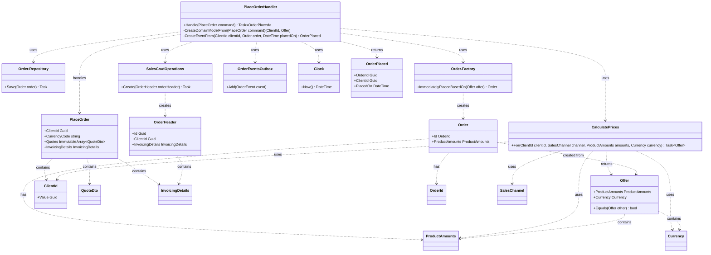
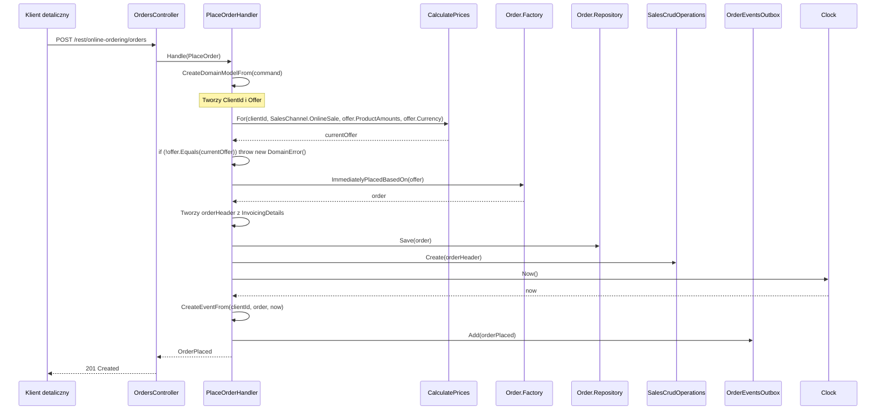

```mermaid
classDiagram
    class PlaceOrderHandler {
        +Handle(PlaceOrder command) Task~OrderPlaced~
        -CreateDomainModelFrom(PlaceOrder command) (ClientId, Offer)
        -CreateEventFrom(ClientId clientId, Order order, DateTime placedOn) OrderPlaced
    }
    
    class CalculatePrices {
        +For(ClientId clientId, SalesChannel channel, ProductAmounts amounts, Currency currency) Task~Offer~
    }
    
    class Order.Repository {
        +Save(Order order) Task
    }
    
    class Order.Factory {
        +ImmediatelyPlacedBasedOn(Offer offer) Order
    }
    
    class SalesCrudOperations {
        +Create(OrderHeader orderHeader) Task
    }
    
    class OrderEventsOutbox {
        +Add(OrderEvent event)
    }
    
    class Clock {
        +Now() DateTime
    }
    
    class PlaceOrder {
        +ClientId Guid
        +CurrencyCode string
        +Quotes ImmutableArray~QuoteDto~
        +InvoicingDetails InvoicingDetails
    }
    
    class OrderPlaced {
        +OrderId Guid
        +ClientId Guid
        +PlacedOn DateTime
    }
    
    class Order {
        +Id OrderId
        +ProductAmounts ProductAmounts
    }
    
    class OrderHeader {
        +Id Guid
        +ClientId Guid
        +InvoicingDetails InvoicingDetails
    }
    
    class Offer {
        +ProductAmounts ProductAmounts
        +Currency Currency
        +Equals(Offer other) bool
    }
    
    class ClientId {
        +Value Guid
    }
    
    class ProductAmounts {
    }
    
    class Currency {
    }
    
    class QuoteDto {
    }
    
    class InvoicingDetails {
    }
    
    PlaceOrderHandler ..> CalculatePrices : uses
    PlaceOrderHandler ..> Order.Repository : uses
    PlaceOrderHandler ..> Order.Factory : uses
    PlaceOrderHandler ..> SalesCrudOperations : uses
    PlaceOrderHandler ..> OrderEventsOutbox : uses
    PlaceOrderHandler ..> Clock : uses
    
    PlaceOrderHandler ..> PlaceOrder : handles
    PlaceOrderHandler ..> OrderPlaced : returns
    
    PlaceOrder ..> ClientId : contains
    PlaceOrder ..> QuoteDto : contains
    PlaceOrder ..> InvoicingDetails : contains
    
    Order.Factory ..> Order : creates
    Order ..> OrderId : has
    Order ..> ProductAmounts : has
    
    CalculatePrices ..> ClientId : uses
    CalculatePrices ..> SalesChannel : uses
    CalculatePrices ..> ProductAmounts : uses
    CalculatePrices ..> Currency : uses
    CalculatePrices ..> Offer : returns
    
    Order ..> Offer : created from
    Offer ..> ProductAmounts : contains
    Offer ..> Currency : contains
    
    SalesCrudOperations ..> OrderHeader : creates
    OrderHeader ..> InvoicingDetails : contains
```

```mermaid

sequenceDiagram
    participant Client as Klient detaliczny
    participant Controller as OrdersController
    participant Handler as PlaceOrderHandler
    participant Prices as CalculatePrices
    participant Factory as Order.Factory
    participant Repo as Order.Repository
    participant Crud as SalesCrudOperations
    participant Outbox as OrderEventsOutbox
    participant Clock as Clock

    Client->>Controller: POST /rest/online-ordering/orders
    Controller->>Handler: Handle(PlaceOrder)
    
    Handler->>Handler: CreateDomainModelFrom(command)
    Note over Handler: Tworzy ClientId i Offer
    
    Handler->>Prices: For(clientId, SalesChannel.OnlineSale, offer.ProductAmounts, offer.Currency)
    Prices-->>Handler: currentOffer
    
    Handler->>Handler: if (!offer.Equals(currentOffer)) throw new DomainError()
    
    Handler->>Factory: ImmediatelyPlacedBasedOn(offer)
    Factory-->>Handler: order
    
    Handler->>Handler: Tworzy orderHeader z InvoicingDetails
    
    Handler->>Repo: Save(order)
    Handler->>Crud: Create(orderHeader)
    
    Handler->>Clock: Now()
    Clock-->>Handler: now
    
    Handler->>Handler: CreateEventFrom(clientId, order, now)
    Handler->>Outbox: Add(orderPlaced)
    
    Handler-->>Controller: OrderPlaced
    Controller-->>Client: 201 Created
```