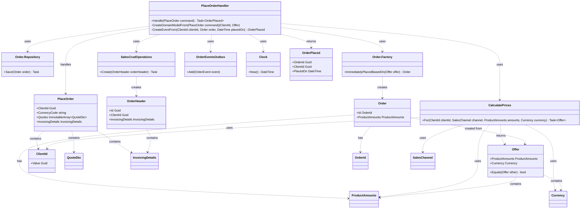

```mermaid
    classDiagram
    %% Handlery
    class OnlinePlaceOrderHandler {
        +Handle(PlaceOrder command) Task~OrderPlaced~
        -CreateDomainModelFrom(PlaceOrder command) (ClientId, Offer)
        -CreateEventFrom(ClientId clientId, Order order, DateTime placedOn) OrderPlaced
    }
    
    class WholesalePlaceOrderHandler {
        +Handle(PlaceOrder command) Task~OrderPlaced~
        -CreateDomainModelFrom(PlaceOrder command) OrderId
        -CreateEventFrom(Order order, DateTime placedOn) Task~OrderPlaced~
    }
    
    %% Komendy
    class OnlinePlaceOrder {
        +ClientId Guid
        +CurrencyCode string
        +Quotes ImmutableArray~QuoteDto~
        +InvoicingDetails InvoicingDetails
    }
    
    class WholesalePlaceOrder {
        +OrderId Guid
    }
    
    %% Zdarzenia
    class OrderPlaced {
        +OrderId Guid
        +ClientId Guid
        +PlacedOn DateTime
    }
    
    %% Zależności współdzielone
    class Order.Repository {
        +GetBy(OrderId orderId) Task~Order~
        +Save(Order order) Task
    }
    
    class SalesCrudOperations {
        +Create(OrderHeader orderHeader) Task
        +Read~OrderHeader~(Guid id) Task~OrderHeader~
    }
    
    class OrderEventsOutbox {
        +Add(OrderEvent event)
    }
    
    class Clock {
        +Now() DateTime
    }
    
    %% Zależności specyficzne dla Online
    class CalculatePrices {
        +For(ClientId clientId, SalesChannel channel, ProductAmounts amounts, Currency currency) Task~Offer~
    }
    
    class Order.Factory {
        +ImmediatelyPlacedBasedOn(Offer offer) Order
    }
    
    %% Modele domenowe
    class Order {
        +Id OrderId
        +ProductAmounts ProductAmounts
        +Place(DateTime placedOn)
    }
    
    class OrderHeader {
        +Id Guid
        +ClientId Guid
        +InvoicingDetails InvoicingDetails
    }
    
    class Offer {
        +ProductAmounts ProductAmounts
        +Currency Currency
        +Equals(Offer other) bool
    }
    
    class ClientId {
        +Value Guid
    }
    
    class OrderId {
        +Value Guid
    }
    
    class ProductAmounts {
    }
    
    class Currency {
    }
    
    class QuoteDto {
    }
    
    class InvoicingDetails {
    }
    
    class SalesChannel {
    }
    
    %% Relacje dla OnlinePlaceOrderHandler
    OnlinePlaceOrderHandler ..> CalculatePrices : uses
    OnlinePlaceOrderHandler ..> Order.Repository : uses
    OnlinePlaceOrderHandler ..> Order.Factory : uses
    OnlinePlaceOrderHandler ..> SalesCrudOperations : uses
    OnlinePlaceOrderHandler ..> OrderEventsOutbox : uses
    OnlinePlaceOrderHandler ..> Clock : uses
    
    OnlinePlaceOrderHandler ..> OnlinePlaceOrder : handles
    OnlinePlaceOrderHandler ..> OrderPlaced : returns
    
    OnlinePlaceOrder ..> ClientId : contains
    OnlinePlaceOrder ..> QuoteDto : contains
    OnlinePlaceOrder ..> InvoicingDetails : contains
    
    Order.Factory ..> Order : creates
    Order ..> OrderId : has
    Order ..> ProductAmounts : has
    
    CalculatePrices ..> ClientId : uses
    CalculatePrices ..> SalesChannel : uses
    CalculatePrices ..> ProductAmounts : uses
    CalculatePrices ..> Currency : uses
    CalculatePrices ..> Offer : returns
    
    Order ..> Offer : created from
    Offer ..> ProductAmounts : contains
    Offer ..> Currency : contains
    
    SalesCrudOperations ..> OrderHeader : creates
    OrderHeader ..> InvoicingDetails : contains
    
    %% Relacje dla WholesalePlaceOrderHandler
    WholesalePlaceOrderHandler ..> Order.Repository : uses
    WholesalePlaceOrderHandler ..> SalesCrudOperations : uses
    WholesalePlaceOrderHandler ..> OrderEventsOutbox : uses
    WholesalePlaceOrderHandler ..> Clock : uses
    
    WholesalePlaceOrderHandler ..> WholesalePlaceOrder : handles
    WholesalePlaceOrderHandler ..> OrderPlaced : returns
    
    WholesalePlaceOrder ..> OrderId : contains
    
    Order.Repository ..> Order : manages
    Order ..> OrderPlaced : creates
    
    SalesCrudOperations ..> OrderHeader : reads
    OrderHeader ..> ClientId : contains
    
    %% Legenda
    class Legend {
        <<interface>>
        +OnlinePlaceOrderHandler
        +WholesalePlaceOrderHandler
        +Order.Repository
        +SalesCrudOperations
        +OrderEventsOutbox
        +Clock
        +CalculatePrices
        +Order.Factory
    }
    ```