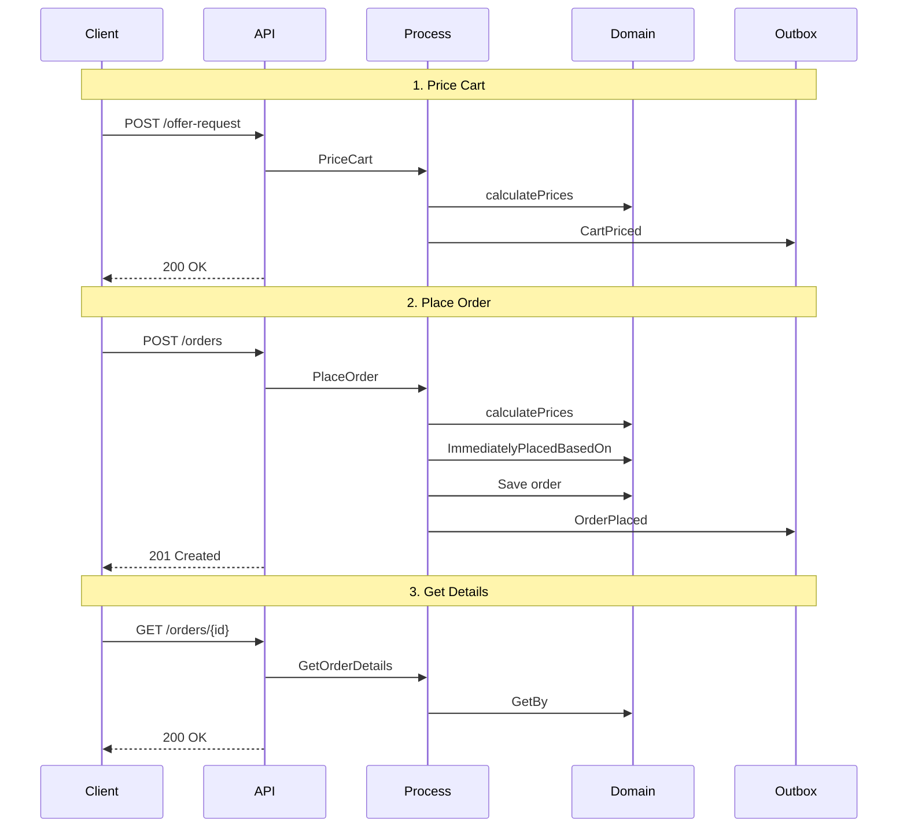

# Proces Online Ordering

## Diagram przepływu procesu

## Funkcjonalności Online Ordering

### Główne cechy:
- **Proces jednokrokowy** - zamówienie składane od razu
- **Natychmiastowa wycena** - ceny obliczane w czasie rzeczywistym
- **Walidacja płatności** - sprawdzenie metod płatności
- **Adres dostawy** - weryfikacja adresu dostawy
- **Potwierdzenie zamówienia** - automatyczne generowanie potwierdzenia

### Endpointy API:
1. `POST /rest/online-ordering/offer-request` - Wycena koszyka
2. `POST /rest/online-ordering/orders` - Złożenie zamówienia
3. `GET /rest/online-ordering/orders/{id}` - Pobieranie szczegółów zamówienia

### Kolejność wywołań:
1. **Price Cart** → Wycena produktów w koszyku (opcjonalne)
2. **Place Order** → Bezpośrednie złożenie zamówienia z produktami
3. **Get Order Details** → Pobieranie szczegółów zamówienia

### Różnice w stosunku do Wholesale:
- **Brak etapu potwierdzenia oferty** - cena jest finalna
- **Brak możliwości modyfikacji** - zamówienie składane od razu
- **Prostszy przepływ** - mniej kroków w procesie
- **Natychmiastowa realizacja** - zamówienie trafia od razu do realizacji
