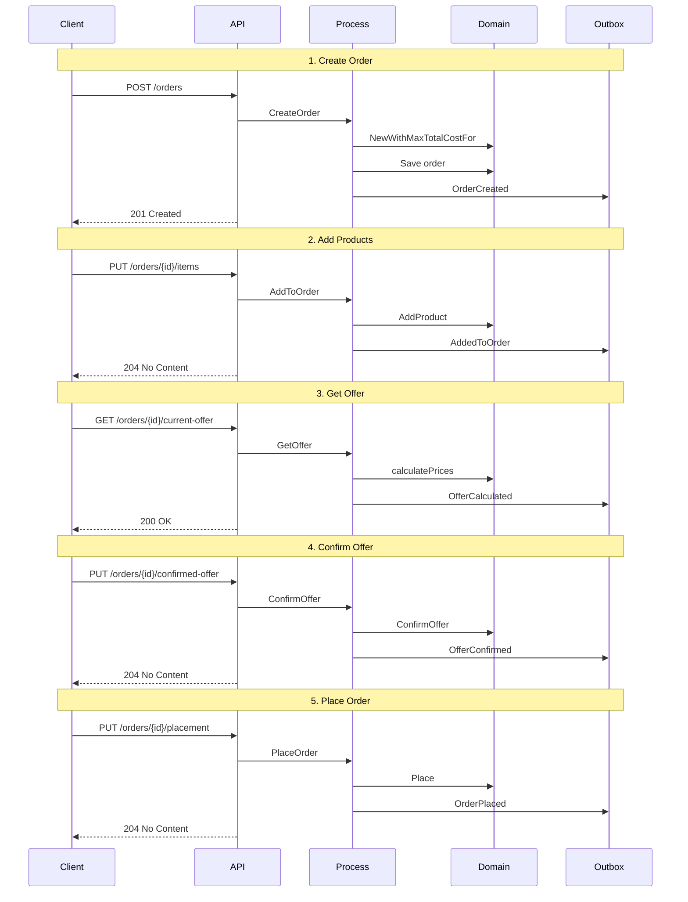

# Proces Wholesale Ordering

## Diagram przepływu procesu

## Funkcjonalności Wholesale Ordering

### Główne cechy:
- **Proces wieloetapowy** - zamówienie przechodzi przez kilka etapów
- **Walidacja biznesowa** - minimum 5 produktów w zamówieniu hurtowym
- **Weryfikacja kredytu** - sprawdzenie zdolności kredytowej klienta
- **Umowy handlowe** - generowanie dokumentów umownych
- **Warunki dostawy** - specjalne warunki dla klientów hurtowych

### Endpointy API:
1. `POST /rest/wholesale-ordering/orders` - Tworzenie zamówienia
2. `GET /rest/wholesale-ordering/orders/{id}` - Pobieranie szczegółów zamówienia
3. `PUT /rest/wholesale-ordering/orders/{id}/items` - Dodawanie produktów
4. `GET /rest/wholesale-ordering/orders/{id}/current-offer` - Pobieranie aktualnej oferty
5. `PUT /rest/wholesale-ordering/orders/{id}/confirmed-offer` - Potwierdzenie oferty
6. `PUT /rest/wholesale-ordering/orders/{id}/placement` - Złożenie zamówienia
7. `GET /rest/wholesale-ordering/quotes` - Szybka wycena produktu

### Kolejność wywołań:
1. **Create Order** → Tworzenie pustego zamówienia
2. **Add Products** → Dodawanie produktów (można wielokrotnie)
3. **Get Offer** → Pobieranie wyceny
4. **Confirm Offer** → Potwierdzenie ceny
5. **Place Order** → Finalne złożenie zamówienia
